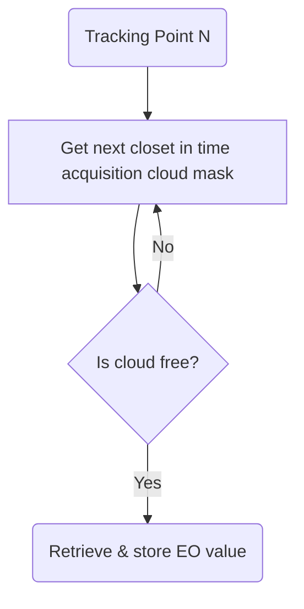

# Match up EO data to tracking points

This code finds the closet in time EO variable for the coordinates/timestamps in the CSV file.

For each tracking point:

The "Get next closet in time acquisition cloud mask" set is done at a coarse resolution,
and the results are cached, to reduce the number of API requests.

This is implemented in matchup.py.
matchup_stats_api_test.py does the same as matchup.py, but uses the Sentinel Hub Statistics API, but it is slower,
so use matchup.py.

## Usage

    python3 matchup.py data/sample.csv data/sample_out.csv

### Modify EO variables

See "evalscript_ndmi" in the matchup.py for the JavaScript code that returns gets the EO value.
Modify it to get other EO variables.

You may need to modify the code if the format of CSV with the tracking data changes.
