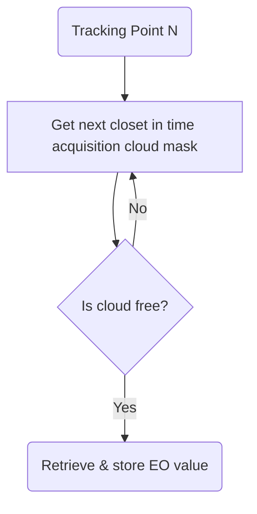

# Match up EO data to tracking points

This code finds the closet in time EO variable for the coordinates/timestamps in the CSV file.

For each tracking point:

This is implemented in matchup_v1. 
matchup_v2 is the Sentinel Hub Statistics API, but it is slower, 
so use matchup_v1.

# Usage 

    python3 matchup_v1 in.csv out.csv

# Modify EO variables 

See "evalscript_ndmi" in the matchup_v1 for the JavaScript code that returns gets the EO value.
Modify it to get other EO variables.
